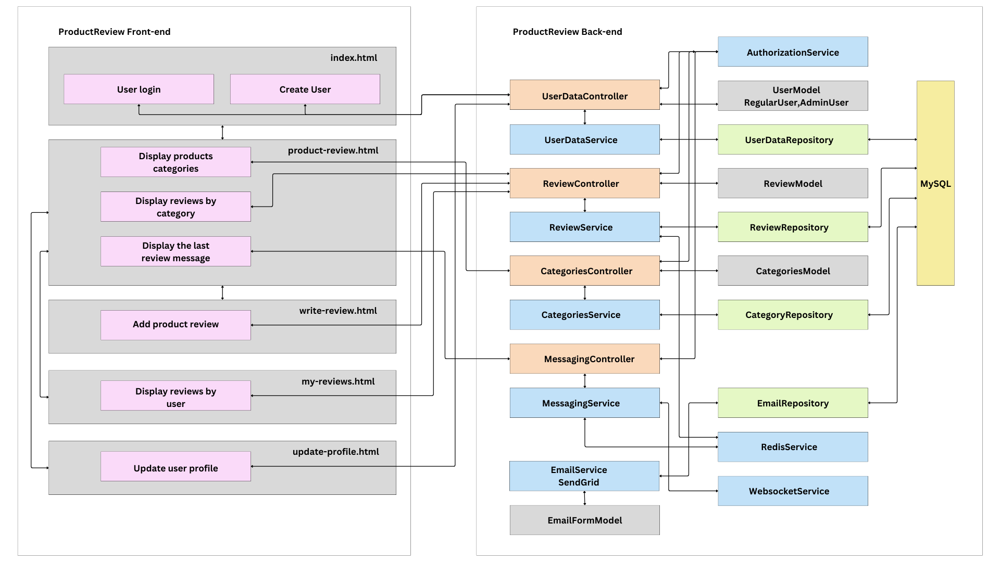

# ProductReview - Product Reviews Platform

This project is a Product Reviews platform. It allows users to write reviews, rate products, and browse reviews based on categories. It includes a frontend built with HTML, CSS, and JavaScript (The frontend for this project is hosted in a separate repository. You can find it [here](https://github.com/vi70sion/product-review-frontend).), and a backend using Java Spring Boot with MySQL. The platform also features real-time notifications and performance optimization using Redis caching.

## Features

### 1. **User Authentication and Authorization**
- **Registration and Login**: Users can register, log in, and leave reviews.
- **Roles**:
  - **Regular User**: Can write reviews, rate products, and view others' reviews.
  - **Administrator**: Can manage and delete inappropriate reviews.

### 2. **Backend (Java Spring Boot)**

## API Documentation

### User Data Controller (`/api/user`)

| HTTP Method | Endpoint           | Description                                                                                   |
|-------------|--------------------|-----------------------------------------------------------------------------------------------|
| `POST`      | `/login`           | Authenticate a user and return a JWT token.                                                  |
| `POST`      | `/add`             | Register a new user and optionally subscribe to newsletters.                                 |
| `PUT`       | `/update`          | Update user details. Requires Authorization header with a valid token.                       |
| `GET`       | `/name`            | Retrieve the name of a user by their ID. Requires Authorization header with a valid token.   |

### Review Controller (`/api/review`)

| HTTP Method | Endpoint           | Description                                                                                   |
|-------------|--------------------|-----------------------------------------------------------------------------------------------|
| `GET`       | `/category`        | Retrieve reviews for a specific category. Requires Authorization header with a valid token.   |
| `GET`       | `/user`            | Retrieve all reviews created by the logged-in user. Requires Authorization header with a valid token. |
| `POST`      | `/add`             | Add a new review. Accepts a review JSON, image, and category as parameters. Requires Authorization header with a valid token. |
| `DELETE`    | `/delete`          | Delete a review by its ID. Requires Authorization header with a valid token.                 |
| `GET`       | `/search`          | Retrieve reviews by search text. Accepts `searchtext` as a query parameter. Requires `Authorization` header with a valid token. |


### Categories Controller (`/api/categories`)

| HTTP Method | Endpoint   | Description                                                                                   |
|-------------|------------|-----------------------------------------------------------------------------------------------|
| `GET`       | `/all`     | Retrieve a list of all product categories. Requires Authorization header with a valid token.  |

#### WebSocket Endpoints

| Action             | Destination        | Description                                                                                  |
|--------------------|--------------------|----------------------------------------------------------------------------------------------|
| `@SendTo`          | `/topic/messages` | Broadcasts messages to all connected users subscribed to this topic.                         |

#### Live Notifications
- Real-time messages about new reviews using WebSocket.
- The `/topic/messages` channel is updated without requiring a page reload.

#### Redis Integration
- Stores and retrieves the latest review for optimized performance.
- Broadcasts the last review during user subscription to `/topic/messages`.

#### Authorization
- Validates the `Authorization` token for all endpoints and WebSocket connections.

#### Scheduled Message
- Sends a message with the latest review to new connected users.

### **Database (MySQL)**

The project uses a MySQL database to store and manage data for users, categories, and reviews. Below is a brief description of the database schema and the SQL scripts to create the necessary tables.

#### **Tables**

**`users`**
   - Stores user information such as ID, name, email, password, and role.
   - Roles are defined as either `USER` or `ADMIN`.
   - Email addresses must be unique.

**`categories`**
   - Stores product categories (e.g., Monitors, Electronics, etc.).
   - Each category is identified by an auto-incremented ID.

**`reviews`**
   - Stores product reviews, including details like the user who created the review, the product name, category, review text, rating, and an optional photo.
   - Enforces a foreign key relationship with `users` and `categories`.
   - Ensures the rating is a value between 1 and 5.

#### **SQL Scripts to Create Tables**

```sql
-- Create the 'users' table
CREATE TABLE `product_review`.`users` (
  `id` CHAR(36) NOT NULL,
  `name` VARCHAR(50) NOT NULL,
  `email` VARCHAR(100) NOT NULL,
  `password` VARCHAR(255) NOT NULL,
  `role` ENUM('USER', 'ADMIN') NULL DEFAULT 'USER',
  PRIMARY KEY (`id`),
  UNIQUE INDEX `email_UNIQUE` (`email` ASC) VISIBLE
)

-- Create the 'categories' table
CREATE TABLE `product_review`.`categories` (
  `id` INT AUTO_INCREMENT PRIMARY KEY,
  `name` VARCHAR(100) NOT NULL
)

-- Create the 'reviews' table
CREATE TABLE `product_review`.`reviews` (
  `id` INT AUTO_INCREMENT PRIMARY KEY,
  `user_id` CHAR(36) NOT NULL,
  `category_id` INT NOT NULL,
  `product_name` CHAR(100) NOT NULL,
  `review_text` TEXT,
  `rating` INT NOT NULL CHECK (rating BETWEEN 1 AND 5),
  `photo` BLOB,
  `created_at` DATETIME,
  FOREIGN KEY (`user_id`) REFERENCES `users`(`id`),
  FOREIGN KEY (`category_id`) REFERENCES `categories`(`id`)
)

-- Create the 'newsletters' table
CREATE TABLE `product_review`.`newsletters` (
  `id` INT AUTO_INCREMENT PRIMARY KEY,
  `content` TEXT,
  `sent_at` DATETIME
)

-- Create the 'news_subscribers' table
CREATE TABLE `product_review`.`news_subscribers` (
  `id` INT AUTO_INCREMENT PRIMARY KEY,
  `email` VARCHAR(50) NOT NULL
)

```
  - **Relationships**:
    - One-to-Many: Users → Reviews, Categories → Reviews

### Application Properties Configuration

The `application.properties` file contains the configuration for the `ProductReview` project. Below is a description of each property used:

#### **Properties**
**Application Information**
   - `spring.application.name`: The name of the application.

**Encryption**
   - `encryption.secretKey`: A secret key used for encryption processes (Base64-encoded key generated for password hashing).
   - `encryption.secretWord`: A salt value to strengthen password encryption.

**Database Configuration**
   - `database.url`: The JDBC URL for connecting to the MySQL database.
   - `database.username`: The username for the database.
   - `database.password`: The password for the database.

**Redis Configuration**
   - `redis.host`: The hostname of the Redis server.
   - `redis.port`: The port number for the Redis server.

**SendGrid Configuration**
   - `sendgrid.api.key`: The API key for SendGrid, used for sending emails (newsletters).


### 3. **Redis Caching**
- Caches the latest reviews for faster client-side rendering.

### 4. **Real-Time Data Streaming**
- **WebSocket**: Live notifications for new reviews are broadcasted to all connected users without page reload.

### 5. **Multithreading**
- **Background Task**: Sends newsletters from table 'newsletters' to subscribed users in the 'news_subscribers' table.

### 6. **Frontend (HTML, CSS, JavaScript)**

The frontend for this project is hosted in a separate repository. You can find it [here](https://github.com/vi70sion/product-review-frontend).

### 7. **Testing**

- **JUnit Tests**
Tests for UserDataService class methods.

#### 7.1. **testAddUserSuccess**
This test verifies the behavior of the `addUser` method in the `UserDataService` class. It ensures that:
- When a user with a unique email is added successfully, the appropriate repository methods are invoked (`addUser` and `saveNewsSubscriber`).
- The method returns an HTTP 200 OK response with the message "User added successfully."

#### 7.2. **testHashPasswordWithSecret**
This test validates the functionality of the `hashPasswordWithSecret` method. It confirms that:
- Given a specific password and secret word, the method correctly hashes the combined string using SHA-256.
- The resulting hash matches the expected value, ensuring the hashing algorithm and implementation are working as intended.

- **Selenium Tests**
The Selenium Tests for this project is hosted in a separate repository. You can find it [here](https://github.com/vi70sion/product-review-autotest.git).
Selenium tests are used to verify the functionality of the Product Review platform through automated UI testing. Below is a brief description of the implemented tests:

#### 7.3. **User Registration Test**
This test verifies the user registration and login functionality:
- Navigates to the registration page.
- Enters user details such as full name, email, and password.
- Submits the registration form and confirms successful account creation.
- Logs in with the newly created credentials.
- Validates that the logged-in user's name matches the expected name.

#### 7.4. **Add Review Test**
This test checks the functionality of adding a new product review:
- Logs in with existing user credentials.
- Navigates to the review submission form.
- Selects a category, enters product details (name, review text, and rating), and uploads an image.
- Submits the review and verifies that it is successfully added.
- Validates the new review appears in the appropriate category's review list.

## Project Diagram

Below is an overview of the project's architecture:



---

## Installation

### Requirements
1. **Java**: JDK 21 or newer.
2. **Spring Boot**: Compatible version installed.
3. **MySQL**: Database service running.
4. **Redis**: Installed and configured.


